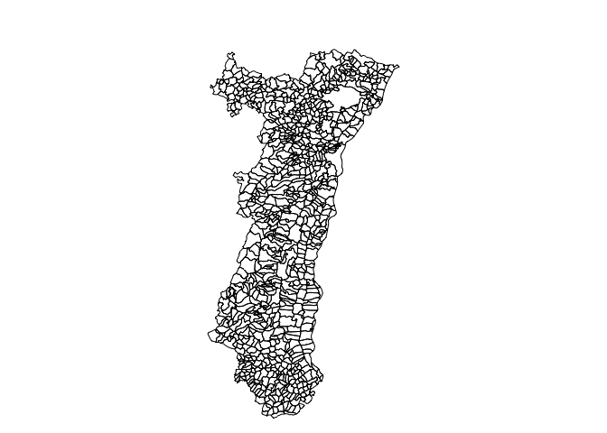
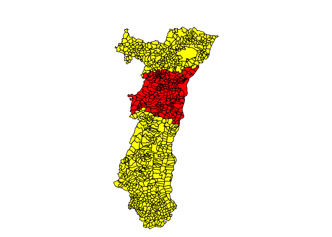
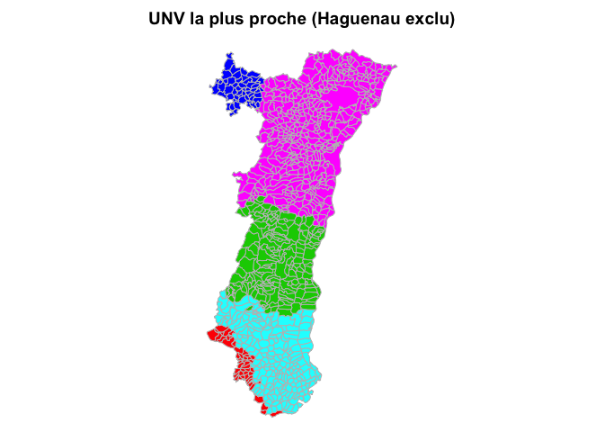

# USIC - UNV
JcB  
9 juillet 2016  

Distancier des UNV
===================


Objectif: calculer un distancier entre les Villes RGE et les UNV et USIC (voir aussi "RPU_Carto_Pop/cartographie/hop_alsace.Rmd").

La géographie régionale est souvent mal connue des opérateurs du SAMU qui se contentent de trouver une destination sur le territoire administratif. Une meilleure destination (en terme de délai) peut exister mais elle ignorée car se situe dans une région hors des limites administratives habituelles (y compris en Allemagne). Le but de ce travail est de proposer des cartes et des listes de distance entre chaque commune d'Alsace et un centre de référence.

1. Récupérer les coordonnées des villes
---------------------------------------

- source: fichier __geofla 2016 - communes__ de l'[IGN](http://professionnels.ign.fr/geofla). Le dossier comprte plusieurs sous dossier. On ne cnserve que le dossier __COMMUNE__ qui est du tpe _shapefile_. Ce dossier contient 2 shapefiles COLMMUNE et LIMITES_COMMUNE. On ne conserve que le cdossier COMMUNE sous le nom de __COM__.

Le shapefile est lu par la commande __readOGR__ de _rgdal_. Avantages:

- accepte la variable _encoding_ qui permet de s'assurer que les data sont lues corectement
- lit automatiquement la projection dans _proj4string_.

```{}

path <- "../Data/COM"
file <-"COMMUNE"
france <- readOGR(dsn = path, layer = file, encoding = "latin1") # règle le pb de accents

# projection des données
france@proj4string
```

2. Transformer les coordonnées en WSG84
---------------------------------------
Reprojeter en WGS 84 , code EPSG : 4326
```{}
france_WGS84 <- spTransform(france, CRS ("+init=epsg:4326"))
```

La transformation fonctionne mais en fait seule les coordonnées des points sont affectées et non le conenu de _data_ qui est un dataframe. Il faut donc extraire de _data_ les données de géolocalisation et les transformer en _spatialPoints_.

```{}
d <- france@data[, c("X_CHF_LIEU", "Y_CHF_LIEU", "INSEE_COM")] 
head(d)

# transformation en spatial points
coordinates(d) = ~ X_CHF_LIEU + Y_CHF_LIEU # transformation en sptialPoint
proj4string(d) = france@proj4string # attribue le référentiel d'origine (Lambert 93)

# Transformation en wsg84
d2 <- spTransform(d, CRS ("+init=epsg:4326"))
head(d2)

# coordoonnées des villes en WSG
x <- d2@coords # matrice de 2 colonnes
colnames(x) <- c("Lon_CHF_LIEU", "Lat_CHF_LIEU")

# Ajout des coord.WSG au SpatialPolygon
france@data <- cbind(france@data, x)
names(france)

# test
france@data[france@data$NOM_COM == "ANDLAU", c("NOM_COM", "Lon_CHF_LIEU", "Lat_CHF_LIEU")]

# Sauvegarde: france est le spatialPolygonDataframe de l'IGN (2016) avec 2 colonnes supplémentaires pour la latitude et la longitude.
save(france, file = "../Data/sp_France.Rda")
```

### communes de la région grand est
Le fichier __rge__ est un dataframe comportant le nom de la commune, son code INSE et sa longitude et latitude:
```{}
rge <- france@data[france@data$CODE_DEPT %in% c(67, 68, 88, 57, 54, 55, 51, 52, 10, "08"), c("NOM_COM", "INSEE_COM", "Lon_CHF_LIEU", "Lat_CHF_LIEU")]
head(rge)

save(rge, file = "../Data/RGE_WGS84.Rda")
```


### communes d'Alsace
```{}
als <- france@data[france@data$CODE_DEPT %in% c(67, 68), c("NOM_COM", "Lon_CHF_LIEU", "Lat_CHF_LIEU")]
head(als)

save(als, file = "../Data/als_WGS84.Rda")
```

3. Création du distancier
-------------------------

```{}
library(osrm)

# fichier des UNV
unv <- read.csv("../UNV.csv")
head(unv)

# on réordonne les colonnes pour que la longitude précède la latitude
unv <- unv[, c(1, 3, 2)]

# boucle pour ne pas dépasser les limites du serveur
# d <- osrmTable(src = als[1:5,], dst = unv) # test
n <- nrow(als) # nb de villes en Alsace
d1 <- NULL
i <- 1
j <- 1
inc <- 90
k <- inc

while(i < n){
d <- osrmTable(src = als[j:k,], dst = unv)
    d1 <- rbind(d1, d$durations)
    j <- k + 1
    k <- k + inc
    if(k > n)
        k = n
    i = k
}
# une boucle supplémentaire pour les dernières villes
d <- osrmTable(src = als[j:k,], dst = unv)
d1 <- rbind(d1, d$durations)

# on arrondit les temps
d1 <- round(d1)
head(d1)

# sauvegarde
write.csv(d1, file <- "../Data/distancier_unv_alsace.csv")

# Ajout du code département et commune pour tri éventuel. On crée un df avec les codes souhaités. L'ordre des communes est exactement celui du distancier , ce qui permet de lier les deux sans erreur de lignes:
als <- france@data[france@data$CODE_DEPT %in% c(67, 68), c("NOM_COM", "CODE_COM", "CODE_DEPT")]
head(als)
d2 <- cbind(als, d1)
head(d2)

# sauvegarde
write.csv(d2, file <- "../Data/distancier_unv_alsace_2.csv")
```

UNV la plus proche
------------------

Pour une commune, quelle est l'UNV la plus proche ?

```r
d1 <- read.csv("../Data/distancier_unv_alsace_2.csv")

d1$choix1 <- NA
for(i in 1:nrow(d1)){d1$choix1[i] = names(which.min(d1[i, 5:14]))}
```

Quel est le meilleur choix si Haguenau n'est pas disponible ?

```r
# sans Haguenau
d1$choix2 <- NA
for(i in 1:nrow(d1)){
    d1$choix2[i] = names(which.min(d1[i, c(5, 7:14)]))
    }

head(d1)
```

```
##     X    NOM_COM CODE_COM CODE_DEPT HTP CH.Haguenau CH.Colmar CH.Mulhouse
## 1  60 DUPPIGHEIM      108        67  15          35        42          65
## 2 115    LUCELLE      190        68 110         129        71          49
## 3 144 ARTOLSHEIM       11        67  46          66        30          51
## 4 217  INNENHEIM      223        67  16          35        38          61
## 5 223  BUSWILLER       68        67  27          22        73          96
## 6 302   MULHOUSE      224        68  70          89        32           5
##   CH.Belfort CH.Epinal Bar.le.Duc CH.Forbach CH.Metz..Mercy.
## 1         83       111        165         82             103
## 2         45       110        205        172             186
## 3         69       103        168        109             130
## 4         79       107        165         83             104
## 5        114       118        144         62              82
## 6         30        92        187        132             153
##   CHU.Nancy..Central.      choix1      choix2
## 1                 110         HTP         HTP
## 2                 149  CH.Belfort  CH.Belfort
## 3                 114   CH.Colmar   CH.Colmar
## 4                 111         HTP         HTP
## 5                  89 CH.Haguenau         HTP
## 6                 131 CH.Mulhouse CH.Mulhouse
```

Deuxième choix possible si le plus proche n'est pas disponible. Adaptation de la méthode __http://stackoverflow.com/questions/2453326/fastest-way-to-find-second-third-highest-lowest-value-in-vector-or-column__. _choix_ correspond au rang du choix.

On suppose haguenau non opérationnel


```r
choix = 2
d1$choix3 <- NA
for(i in 1:nrow(d1)){
    x <- d1[i, c(5, 7:14)]
    n <- length(x) # en fait c'est une constante
    y = sort(x,partial=n-1)[choix]
    d1$choix3[i] = names(y)
    }
    
# sauvegarde de la matrice des temps et meilleur choix

write.csv(d1, file <- "../Data/distancier_unv_alsace_meilleur_choix.csv")
```

head(d1)

Cartographie
------------

```r
#france
load("sp_France.Rda")

alsace <- france[france@data$CODE_DEPT %in% c("67","68"),]
par(mar = c(0,0,2,0))
plot(alsace)
```

<!-- -->

```r
# alsace et d1 conservent le même ordre des communes, ce qui facilite l'ajout des colonnes choix au dataframe alsace.
alsace@data$CHOIX1 <- d1$choix1
plot(alsace, col = ifelse(alsace$CHOIX1 == "HTP", "red", "yellow"))
```

<!-- -->

```r
alsace@data$CHOIX2 <- d1$choix2
plot(alsace, col = as.numeric(as.factor(alsace$CHOIX2)) + 1, border = "gray", main = "UNV la plus proche (Haguenau exclu)")
```

<!-- -->

